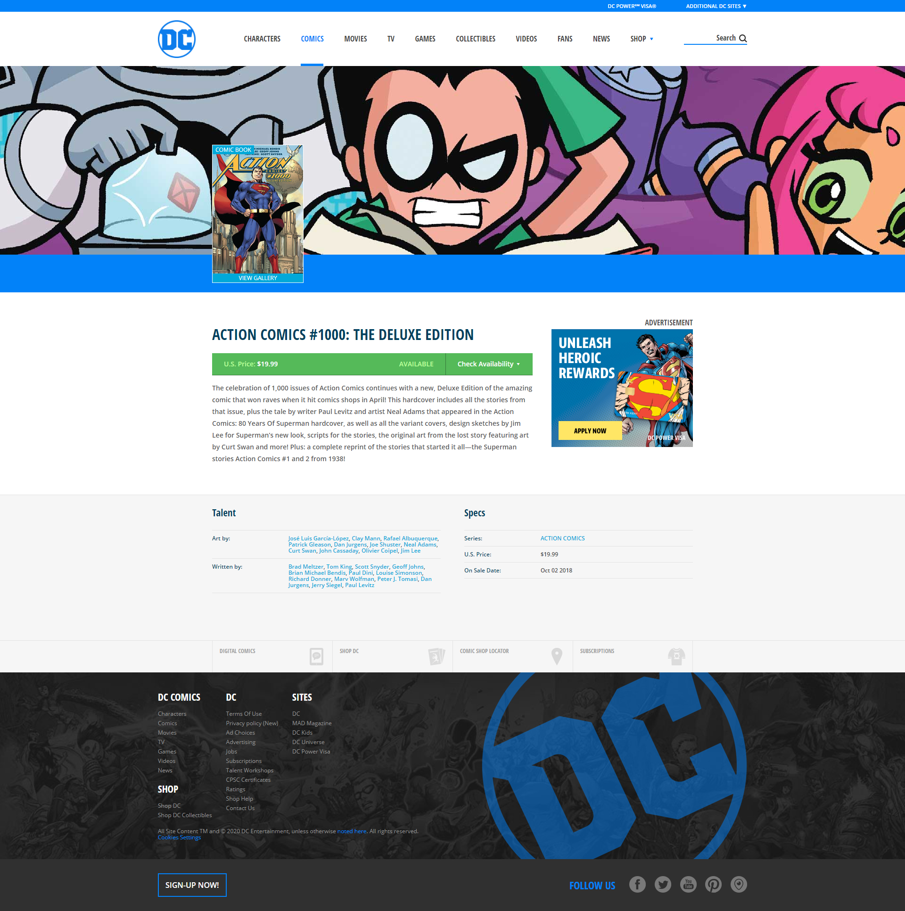

## Esercizio di oggi: Laravel Comics Layout

Create un nuovo progetto Laravel.

Concentratevi sul layout: create un file di layout in cui inserire la struttura comune di tutte le pagine del sito web (tag head, tag body, ...) eventualmente includendo header e footer tramite due partials.

Create poi una rotta per visualizzare la lista di tutti i fumetti recuperati da un file inserito nella cartella config e abbellite il tutto sfruttando Sass.

Bonus: Create più pagine istituzionali che condividono lo stesso layout.

Steps installazione SASS e Bootstrap:
1. composer require pacificdev/laravel_9_preset
2. php artisan preset:ui bootstrap
3. npm i
4. Rimuovere riga 3 del package.json (type: module)
5. npm run dev
6. Importare gli assets con la direttiva @vite() nella `<head>` del vostro layout.

## Esercizio di oggi: Laravel Comics Detail Page

Continute a lavorare sul vostro progetto DC comics, questa volta aggiungendo una rotta dinamica che visualizzi la pagina del dettaglio.

Procediamo per step:
1. Dichiariamo una rotta che riceva in ingresso un parametro che rappresenta l'indice del fumetto.
2. Grazie a questo indice individuiamo il giusto fumetto e stampiamolo in pagina con un dd()
3. Proviamo se tutto funziona mettendo l'indirizzo a mano nella barra di ricerca del browser.
4. Se tutto funziona, andiamo nella pagina con la lista dei fumetti e montiamo il link dinamicamente su ognuna delle copertine.  (possiamo farlo sia con url() che con route()).
5. Se anche così riusciamo a vedere il dump corretto del fumetto, procediamo a generare una vista per la pagina di dettaglio e ad inviare il prodotto a questa vista.
6. Infine, create un markup e uno style come mostrato nell'immagine in allegato!

